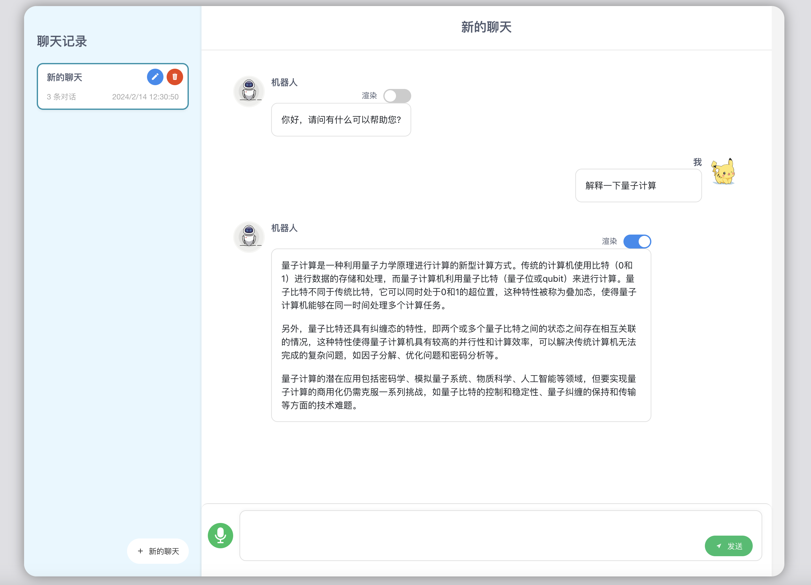

## 大模型问答页面

### 1. 使用方式

修改App.vue里关于API-URL和API-KEY的配置（在118、119行），可以使用第三方API，按照OpenAI接口格式即可。

```
$ npm install            // 安装依赖
$ npm run serve          // 启动服务
$ npm run build          // 打包页面
```

### 2. 页面效果

支持多个聊天会话，支持保留历史记录，支持Markdown格式渲染。


